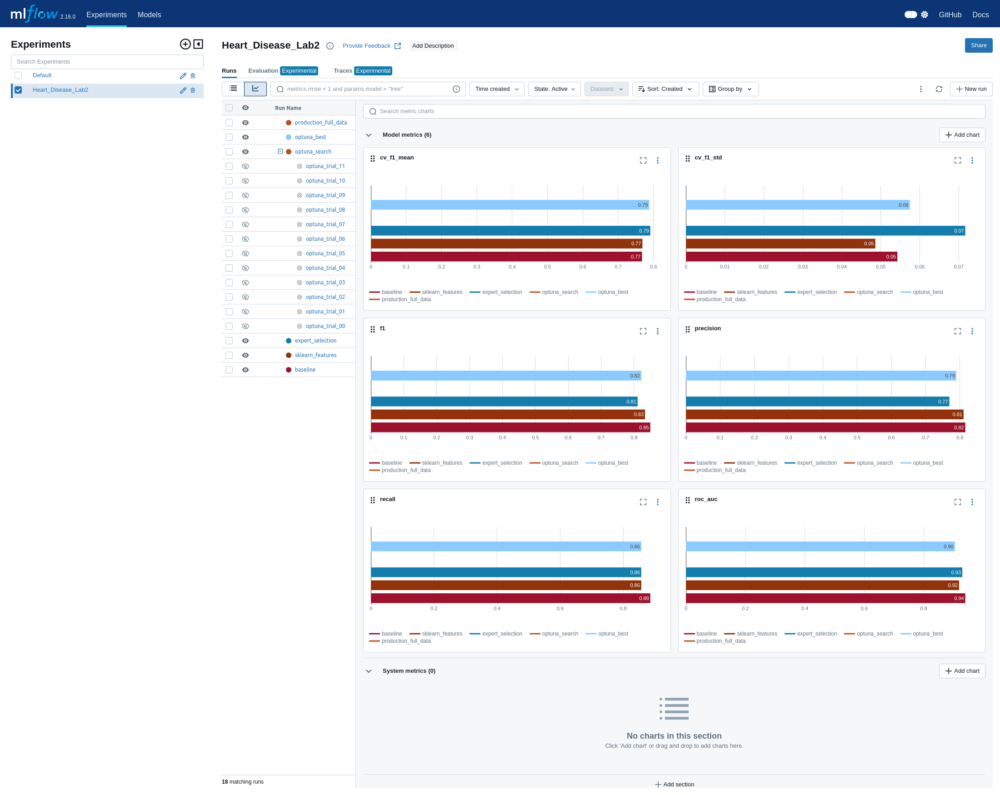
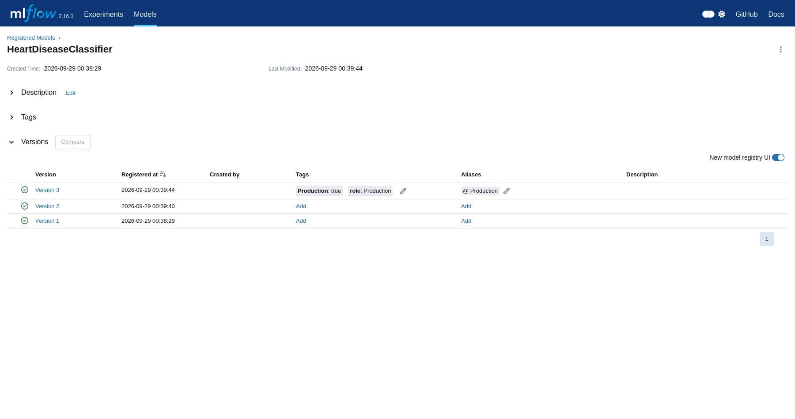

# Классификация наличия сердечно-сосудистого заболевания

Лабораторные работы № 1–2: разведочный анализ данных и эксперименты по настройке модели.

**Студент:** Лукожев Ильяс Хусенович  
**Группа:** А-02м-25

## Описание проекта

Проект решает задачу бинарной классификации: по 13 клиническим признакам требуется определить наличие у пациента сердечно-сосудистого заболевания. Используется поднабор Cleveland из [Heart Disease Dataset (UCI)](https://archive.ics.uci.edu/dataset/45/heart+disease), содержащий 303 наблюдения. Исходная целевая переменная `num` преобразуется в `target`: `0` — заболевание не выявлено, `1` — заболевание присутствует (`num > 0`).

Выполненный анализ находится в [`eda/eda.ipynb`](eda/eda.ipynb). Ноутбук содержит результаты всех ячеек и воспроизводит сохраненные графики и очищенный датасет.

Обязательная часть ЛР2 выполнена в [`research/research.ipynb`](research/research.ipynb), все ячейки исполнены. Необязательные пункты 11, 13 и 15 (autofeat, алгоритмический отбор и CatBoost) не выполнялись по выбору студента. Реализация пайплайнов и логирования вынесена в [`research/experiments.py`](research/experiments.py).

## Запуск

```bash
git clone https://github.com/LukozhevIK/lab_3_sem.git
cd lab_3_sem

python3 -m venv .venv_heart_disease
source .venv_heart_disease/bin/activate
python -m pip install --upgrade pip
python -m pip install -r requirements.txt

curl -L "https://archive.ics.uci.edu/ml/machine-learning-databases/heart-disease/processed.cleveland.data" \
  -o data/heart_disease.csv

jupyter notebook eda/eda.ipynb
```

В Jupyter следует выполнить `Kernel -> Restart Kernel and Run All Cells`. Код блокнота корректно определяет корень проекта при запуске как из корня, так и из директории `eda`.

### Запуск MLflow и ЛР2

Нужен Python 3.10. Версии `numpy==1.26.4` и `mlflow==2.16.0` закреплены согласно заданию. Сначала выполните ЛР1, чтобы получить `data/clean_dataset.pkl`. Если старый pickle создан под NumPy 2 и не читается после смены версии, выполните `python research/restore_data.py`: скрипт сохраняет оригинал как `data/clean_dataset_numpy2.pkl` и повторяет только загрузку и очистку из EDA, не меняя ноутбук ЛР1 и графики. Сырые данные должны быть предварительно скачаны.

В первом терминале, из корня проекта:

```bash
source .venv_heart_disease/bin/activate
sh mlflow/start_mlflow.sh
```

Скрипт сам переходит в `mlflow/`, создаёт SQLite-базу `mlflow/mlruns.db` и хранит артефакты в `mlflow/mlartifacts/`. Откройте [MLflow UI](http://localhost:5000/), эксперимент `Heart_Disease_Lab2`. Сервер доступен только локально. Остановка — `Ctrl+C` в терминале сервера.

Во втором терминале:

```bash
source .venv_heart_disease/bin/activate
jupyter notebook research/research.ipynb
```

Выберите ядро `.venv_heart_disease` в VS Code либо запустите Jupyter из активированного окружения. Выполните все ячейки по порядку. MLflow должен оставаться запущенным. Повторное выполнение создаёт новые прогоны и следующие версии модели; alias `Production` обновляется, поэтому номера версий могут отличаться от сохранённого отчёта.

Проверка результатов без повторного обучения:

```bash
python research/verify_lab.py
python -m pip check
```

Для пересборки ноутбука из `research/research.py` используется `python research/build_notebook.py` (результаты ячеек сбрасываются). Вариант `--keep-outputs` разрешает только обновление текста при неизменном коде. Ноутбук также можно редактировать непосредственно в VS Code.

## Структура проекта

```text
heart-disease-eda/
├── data/                         # локальные данные (не входят в Git)
│   ├── heart_disease.csv         # исходный датасет
│   └── clean_dataset.pkl         # очищенный датасет
├── eda/
│   ├── eda.ipynb                 # воспроизводимый EDA
│   ├── *.png                     # статические графики
│   └── interactive_*.html        # интерактивный график
├── research/
│   ├── research.ipynb           # исполненная ЛР2 с выводами
│   ├── experiments.py          # пайплайны, Optuna, логирование
│   ├── results.json            # метрики и run_id четырёх моделей
│   ├── production.json         # конфигурация финальной модели
│   ├── *columns.json           # имена расширенных/отобранных столбцов
│   ├── selected_indices.json   # индексы отобранных признаков
│   ├── optuna_trials.json      # результаты 12 испытаний
│   ├── model_runs.png          # настоящие скриншоты MLflow
│   ├── model_versions.png
│   └── MLmodel                 # метаданные Production-модели
├── mlflow/
│   ├── start_mlflow.sh          # скрипт входит в Git
│   ├── mlruns.db               # локальная SQLite-база, не в Git
│   └── mlartifacts/            # модели/артефакты, не в Git
├── backups/                    # резервные архивы, не в Git
├── .gitignore
├── README.md
└── requirements.txt
```

Файлы `*.csv` и `*.pkl` намеренно исключены из Git. Их необходимо хранить отдельно и передавать защищенным каналом.

## Результаты EDA

### Исходные данные и очистка

- Исходный набор содержит 303 строки, 13 входных признаков и целевой столбец; полных дубликатов нет.
- Найдены 4 пропуска в `ca` и 2 в `thal`. Они заполнены модами соответствующих столбцов, поскольку их доля мала, а признаки дискретны.
- Проверены допустимые диапазоны и множества категорий — дополнительных невалидных значений не обнаружено.
- Категориальные и числовые типы исправлены. Исходный диагноз `num` преобразован в `target = (num > 0)`.
- Создан признак `age_group`: `<45`, `45–54`, `55–64`, `65+`.
- Итоговый набор содержит 303 строки и 15 столбцов, не имеет пропусков и сохранен локально как `data/clean_dataset.pkl`.

### Выявленные закономерности

- Цель близка к сбалансированной: 164 наблюдения класса 0 (54,1%) и 139 класса 1 (45,9%).
- Пациенты положительного класса в среднем старше: 56,6 года против 52,6.
- Бессимптомный тип боли в груди (`cp = 4`) связан с долей заболевания 72,9%; для остальных типов — 18–30%.
- При стенокардии от нагрузки (`exang = 1`) доля заболевания равна 76,8%, без нее — 30,9%.
- Средняя максимальная ЧСС (`thalach`) в положительном классе ниже: 139,3 против 158,4.
- Средний `oldpeak` в положительном классе выше: 1,57 против 0,59.
- Среди рассмотренных числовых признаков наибольшая абсолютная корреляция с целью у `ca` (+0,46), `oldpeak` (+0,42) и `thalach` (−0,42).

Для будущей модели наиболее перспективны `cp`, `exang`, `thalach`, `oldpeak`, `ca` и `age`. Следует проверить нелинейности и взаимодействие `age × thalach`, использовать стратифицированное разбиение и кросс-валидацию. Наблюдаемые связи не доказывают причинность, а небольшой набор не позволяет делать медицинские выводы.

### Артефакты

В папке `eda` сохранены семь PNG-графиков и интерактивный Plotly-график `08_interactive_age_thalach.html`. Каждый график сопровождается выводом в ноутбуке. Размер каждого артефакта значительно меньше 10 МБ.

## Контрольные вопросы

### Для чего нужен `requirements.txt`?

Файл перечисляет прямые зависимости проекта и зафиксированные версии. После создания нового окружения команда `python -m pip install -r requirements.txt` воспроизводит набор необходимых библиотек. В него не нужно бездумно копировать весь `pip freeze`, поскольку тот включает транзитивные зависимости.

### Что такое виртуальное окружение?

Это изолированная установка Python и пакетов для конкретного проекта. Она предотвращает конфликты версий между проектами и не изменяет системный Python.

### Как создать виртуальное окружение?

В корне проекта: `python3 -m venv .venv_heart_disease`, затем активировать командой `source .venv_heart_disease/bin/activate`. Выход из окружения — `deactivate`.

### Зачем нужен разведочный анализ данных?

EDA помогает понять структуру и качество данных, обнаружить пропуски, ошибки, выбросы и дубликаты, проверить распределения и баланс цели, выявить связи между признаками, сформировать новые признаки и выбрать подходящую стратегию подготовки и моделирования.

### Какие графики когда применять?

- Гистограмма и KDE — распределение числового признака.
- Boxplot или violin plot — сравнение распределений между группами и поиск крайних значений.
- Столбчатая диаграмма — частоты категорий или агрегированная величина по категориям.
- Scatter plot — связь двух числовых признаков; цвет и символ позволяют добавить группы.
- Линейный график — изменение показателя по упорядоченной шкале, чаще по времени.
- Heatmap — компактное представление матрицы, например корреляций или ошибок классификации.
- Интерактивный график — детальное исследование отдельных точек с наведением, масштабированием и фильтрацией.

## Результаты исследования (ЛР2)

Разбиение стратифицированное: train — 227 строк, test — 76, `random_state=42`. Вход включает 6 числовых и 8 категориальных столбцов. Категории приводятся к строкам; `TargetEncoder` обучается внутри пайплайна. Для выбора модели используется **средний F1 на пяти стратифицированных CV-разбиениях train**. Тест не участвует в подборе параметров.

| Прогон | Precision (test) | Recall (test) | F1 (test) | ROC-AUC (test) | CV F1 ± std |
|---|---:|---:|---:|---:|---:|
| baseline | 0.8158 | 0.8857 | 0.8493 | 0.9397 | 0.7675 ± 0.0542 |
| sklearn_features | 0.8108 | 0.8571 | 0.8333 | 0.9188 | 0.7686 ± 0.0486 |
| expert_selection | 0.7692 | 0.8571 | 0.8108 | 0.9296 | **0.7909 ± 0.0717** |
| optuna_best | 0.7895 | 0.8571 | 0.8219 | 0.9045 | 0.7879 ± 0.0574 |

Baseline показывает лучший результат на тесте. Добавление признаков само по себе качество не улучшило. Экспертный отбор выигрывает по заранее выбранному CV-критерию, поэтому именно он выбран для Production. Различия малы относительно разброса CV; уверенного статистического превосходства эти результаты не доказывают.

В расширенном наборе 26 столбцов: 14 исходных преобразованных, 9 выходов `PolynomialFeatures(degree=2, include_bias=False)` для `age`, `thalach`, `oldpeak` и 3 выхода `KBinsDiscretizer`. Полиномиальные признаки и бины масштабируются. Временных рядов нет, поэтому `SplineTransformer` не применяется. Экспертный отбор оставляет 13 из 26 столбцов (50%). Имена и индексы сохранены в JSON и в MLflow.

Optuna выполнила 12 завершённых trials, `direction="maximize"`, целевая метрика — train CV F1. Диапазоны: `n_estimators ∈ {50,100,150,200}`, `max_depth ∈ [3,12]`, `max_features ∈ [0.1,1.0]`. Лучшее испытание №3: 150 деревьев, глубина 3, `max_features=0.9729188669457949`. Оно не превзошло исходный экспертный вариант по CV. Все испытания залогированы как вложенные прогоны.

### Production-модель для следующей работы

- Реестр: `HeartDiseaseClassifier`; v1 — baseline, v2 — Optuna, **v3 — Production**.
- Теги v3: `Production=true`, `role=Production`; alias: `Production`.
- `run_id` финального прогона: `996e0375cdaf4623bad02f88fcf0ea43`.
- Исходный выбранный прогон: `0cf92e5838c647e3b8d13ec5c968754d` (`expert_selection`).
- RandomForest: `n_estimators=100`, `max_depth=None`, `max_features="sqrt"`, `min_samples_leaf=1`, `random_state=42`, `n_jobs=2`.
- Pipeline: `transform → selection → classification`. Финальная версия переобучена на всех 303 строках. Ей **не приписываются** тестовые метрики исходной модели, и у её MLflow-прогона нет метрик качества.

После `transform` отбираются:

```text
numeric__age, numeric__thalach, numeric__oldpeak, numeric__ca,
categorical__sex, categorical__cp, categorical__exang,
categorical__slope, categorical__thal,
polynomial__age thalach, polynomial__thalach oldpeak,
bins__age, bins__thalach
```

На вход полной модели подаются все 14 столбцов: `age`, `sex`, `cp`, `trestbps`, `chol`, `fbs`, `restecg`, `thalach`, `exang`, `oldpeak`, `slope`, `ca`, `thal`, `age_group`. Шесть числовых — `age`, `trestbps`, `chol`, `thalach`, `oldpeak`, `ca`; остальные восемь — строки. Например, `sex="1"`, а не число 1. `age_group` формируется как в ЛР1 (`<45`, `45–54`, `55–64`, `65+`). Пайплайн самостоятельно преобразует вход и отбирает 13 итоговых признаков.

Загрузка модели при работающем MLflow:

```python
import mlflow
import mlflow.sklearn

mlflow.set_tracking_uri("http://127.0.0.1:5000")
model = mlflow.sklearn.load_model("models:/HeartDiseaseClassifier@Production")
# model.predict(X_new), model.predict_proba(X_new)[:, 1]
```

В MLflow сохранены sklearn-модель, сигнатура входа/выхода, пример входа, зависимости и списки входных/итоговых столбцов. Копия метаданных: [`research/MLmodel`](research/MLmodel). Сам файл `MLmodel` не содержит обученные веса: для восстановления нужна вся папка `mlflow`, в том числе `mlartifacts`.

Ограничения: малая выборка; заполнение шести пропусков и EDA выполнены по всем данным в ЛР1; экспертный набор опирается на этот EDA. Поэтому тест не является полностью независимой оценкой всего процесса. В реальном проекте импутацию и исследование признаков проводят только на train, а окончательную оценку — на отдельном нетронутом наборе. Работа учебная, модель не предназначена для медицинского применения.

### Скриншоты MLflow

Ниже настоящие снимки локального интерфейса: все 18 прогонов раскрыты, trial-прогоны скрыты только с графиков для читаемости сравнения четырёх моделей.





При необходимости повторить снимки:

```bash
python -m pip install -r research/requirements-tools.txt
PLAYWRIGHT_BROWSERS_PATH=research/.local/browsers python -m playwright install chromium
python research/capture_mlflow.py
```

### Резервная копия

База, веса, примеры данных и резервные архивы исключены из Git. Скрипт запуска MLflow входит в Git. Для безопасного снимка SQLite и всех артефактов:

```bash
python research/backup_mlflow.py
```

Архив `backups/lab2_mlflow_ДАТА_ВРЕМЯ.tar.gz` содержит `mlflow/mlruns.db`, `mlflow/mlartifacts`, скрипт запуска, исходный и очищенный датасеты. Созданный при выполнении работы архив также скопирован в общую папку `/media/sf_ubuntu/`, то есть доступен на основной машине вне виртуальной Ubuntu. Сохраните его отдельно вместе с проектом для ЛР3.

Для восстановления распакуйте архив **в новый клон проекта** (не поверх действующей базы с более новыми прогонами):

```bash
tar -xzf /путь/к/lab2_mlflow_ДАТА_ВРЕМЯ.tar.gz -C /путь/к/lab_3_sem
cd /путь/к/lab_3_sem
sh mlflow/start_mlflow.sh
```

### Контрольные вопросы ЛР2

1. **Feature extraction:** создание новых представлений исходных данных, например взаимодействий, квадратов и бинов, чтобы раскрыть дополнительные закономерности.
2. **Feature selection:** сохранение полезного поднабора признаков для уменьшения избыточности, сложности и потенциального переобучения. В работе используется экспертный отбор по EDA.
3. **MLflow:** хранение параметров, метрик и артефактов экспериментов, сравнение прогонов в UI, упаковка модели с сигнатурой и зависимостями, регистрация и версионирование.
4. **Гиперпараметры:** настройки, заданные до обучения, например число деревьев, глубина и `max_features`. Их выбирают экспертно, перебором либо оптимизатором; здесь Optuna максимизирует CV F1 только на train.
5. **Pipeline:** последовательность подготовки и применения модели. В работе `ColumnTransformer(StandardScaler, TargetEncoder, PolynomialFeatures, KBinsDiscretizer) → отбор столбцов → RandomForest`; при необходимости добавляются импутация и другие train-only преобразования.

## Источник данных

Janosi, A., Steinbrunn, W., Pfisterer, M., & Detrano, R. (1989). *Heart Disease* [Dataset]. UCI Machine Learning Repository. DOI: [10.24432/C52P4X](https://doi.org/10.24432/C52P4X). Лицензия: CC BY 4.0.
